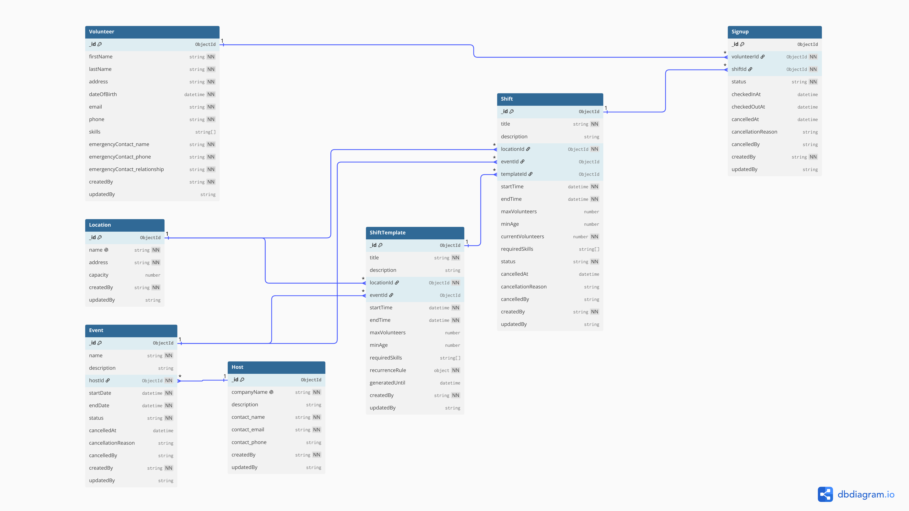

# hackillinois-systems-challenge
**HackIllinois 2027 Systems Coding Challenge** by Albert Bogdan from 9/4/2026 - 9/8/2026

**Prompt:**
Using TypeScript, Express, and MongoDB, implement a volunteer backend API for creating/managing volunteer shift signups. The goal is to demonstrate your understanding of API design, database modeling, and TypeScript fundamentals. 
We recommend using Mongoose and Zod for validation, but feel free to use a different solution if you feel it better fits the problem.
We have intentionally given you few details -- we want to see that you can think about what a system needs to do and how to design it around its functionality. You do not need to handle authentication. Writing comprehensive tests is highly recommended!

## Features & Ideas

- **Full CRUD** for hosts, volunteers, locations, events, shifts, signups, and recurring shift templates.
- **Hosts own events** — each event belongs to a host (the organization running it), with an endpoint to list a host's events. Notes: This was made because a single organization (e.g. HackIllinois) may run many distinct events, and admins want to see all events tied to a given host.
- **Events group shifts** with summary stats (fill rate, signup counts, total volunteer hours) and auto-complete once their end date passes. Notes: This was made because an event (e.g. HackIllinois 2027) may have tons of shifts that are a part of it. Admins can then see overall statistics on how the volunteering for this event is doing. 
- **Shift capacity** with optional caps (`maxVolunteers`). Uncapped shifts never fill, and capped shifts can't exceed their location's capacity. Notes: This was made because a shift (e.g. HackIllinois 2027 Shirt Distribution) may have a capacity for how many people are needed, and the location (e.g. Siebel 1st Floor) may have regulations on how many people can be there. This is an optional parameter because some events (e.g. cleaning up litter in NYC) do not have a realistic capacity that needs to be enforced. 
- **Signup eligibility checks** on create: required-skill matching, an age gate (`minAge` vs. the volunteer's age at shift start), and capacity. Notes: Some shifts will need some kind of validity with a certification or skills that the person needs to have (e.g. CPR certification). Age may also be a requirement, as some events need adults rather than kids. I thought it would make a lot of sense that some shifts have requirements to sign-up so that people who do not match the criteria accidentally join. 
- **Automatic waitlisting** when a shift is full, with promotion of the next waitlisted volunteer when a confirmed spot frees up. Notes: This is in order that people could sign-up for a waitlist like in real life for a full event. In the real world, perhaps an E-mail or SMS message can be sent to the person who goes from the waitlist to activation. 
- **Signup lifecycle** via a validated status state machine — confirm/waitlist, cancel, check-in/check-out, and no-show marking. Notes: This matches the typical clock-in cycle of a person. 
- **Volunteer hours** computed from check-in/check-out times, exposed per volunteer and via a leaderboard. Notes: People who need volunteer hours for a certain task can easily access their total count. 
- **Cascading cancellation** — cancelling an event cancels its shifts and their signups; cancelling a shift cancels its signups. Notes: If a real-life event is canceled (e.g. HackIllinois 2027) (hopefully not), there should not be any other shifts that take place that are tied to the event. 
- **Recurring shifts** defined by template recurrence rules (daily/weekly/monthly with interval and days-of-week), expanded to occurrences on read and materialized into real shifts only when signed up for or individually edited — a Google Calendar–style model (see [How recurring shifts work](#how-recurring-shifts-work)). Notes: This exists in case an event happens repeatedly (e.g. Monday Soup Kitchen 7-8pm). Occurrences stay virtual until they're acted on, so editing the series vs. a single occurrence behaves like a calendar app. 
- **Validation & pagination** everywhere via Zod schemas, with a shared pagination helper on all list endpoints.
- **OpenAPI/Swagger docs** served at `/docs`, and an **in-memory MongoDB** test suite that needs no external database.

## Setup & Run

**Prerequisites:** Node.js 18+, MongoDB running locally (or a MongoDB Atlas URI)

```bash
# Install dependencies
npm install

# Configure environment
cp .env.example .env
# Edit .env if your MongoDB URI differs from the default (mongodb://localhost:27017/volunteer)

# Start development server
npm run dev
```

The API will be available at `http://localhost:3000`.  
Swagger UI docs are at `http://localhost:3000/docs` (raw OpenAPI spec at `/docs.json`).

## Run Tests

Tests use an in-memory MongoDB instance — no external database needed.

```bash
npm test
```

## Database Schema



See [db_schema.pdf](db_schema.pdf) for the full entity-relationship diagram.

## How recurring shifts work

A recurring shift is stored as **one rule** (a shift template), not many rows. Occurrences are **virtual** — computed from the rule on read — and only become real `Shift` rows when someone acts on one (signs up, or edits that occurrence). This mirrors the Google Calendar / iCalendar model, and it's what makes "edit this occurrence" vs. "edit the whole series" behave sanely.

- **View** — `GET /shift-templates/:id/occurrences?from&to` expands one series; `GET /shifts/calendar?from&to` expands every series plus standalone shifts into one schedule.
- **Materialize** — the first signup (or single-occurrence edit) creates the row, keyed by `(templateId, recurrenceId)`, where `recurrenceId` is the occurrence's **original start time** — the stable id, so an occurrence that's later moved still maps back to its slot.
- **Edit one** (`PUT …/:id/occurrences`) — materializes the occurrence and marks it `detached`, so it keeps its own change.
- **Edit all** (`PUT /shift-templates/:id`) — updates the series; virtual occurrences recompute for free and non-detached rows follow, while detached ones keep their edits. Changing the *schedule* (recurrence rule) is rejected (409) once occurrences exist — split instead.
- **This and following** (`PUT …/:id/split`) — ends the series at a chosen occurrence and starts a new series for the rest.

Series are always bounded (the rule requires an `endDate` or an `occurrences` count), and occurrence queries are capped at a 366-day window. Run the whole lifecycle end-to-end against an in-memory DB with:

```bash
npx ts-node scripts/recurring-demo.ts
```

## Project Structure

Each service follows the same layered pattern:

- `*-router.ts` — Express routes (HTTP layer)
- `*-lib.ts` — business logic
- `*-schemas.ts` — Mongoose model + Zod validation
- `*-router.test.ts` — tests

```
src/
├── app.ts            # Express app setup and router mounting
├── server.ts         # Entry point — connects to MongoDB and starts the server
├── common/           # Shared infra: db, errors, pagination, OpenAPI, shared schemas, test setup
└── services/          # One folder per domain, each mounted under /<name>
    ├── host/         # Hosts (organizations running events) — CRUD, plus list a host's events
    ├── location/     # Physical locations — CRUD
    ├── volunteer/    # Volunteers — CRUD, plus per-volunteer signups, logged hours, and a leaderboard
    ├── event/        # Events (groups of shifts) — CRUD, cancel, summary stats, list shifts
    ├── shift/        # Individual shifts — CRUD, cancel, mark no-shows, list signups
    ├── signup/       # Volunteer-to-shift signups — create/list, cancel, check-in/out, status updates
    └── shift-template/  # Recurring shift templates — CRUD; occurrences expand from the rule on read, materialize on signup/edit
```

## API Endpoints

Interactive docs are available at `http://localhost:3000/docs` (Swagger UI). List endpoints support pagination.

### Locations (`/locations`)
| Method | Path | Description |
| --- | --- | --- |
| GET | `/locations` | List locations |
| GET | `/locations/:id` | Get a location |
| POST | `/locations` | Create a location |
| PUT | `/locations/:id` | Update a location |
| DELETE | `/locations/:id` | Delete a location |

### Hosts (`/hosts`)
| Method | Path | Description |
| --- | --- | --- |
| GET | `/hosts` | List hosts |
| GET | `/hosts/:id` | Get a host |
| GET | `/hosts/:id/events` | List a host's events |
| POST | `/hosts` | Create a host |
| PUT | `/hosts/:id` | Update a host |
| DELETE | `/hosts/:id` | Delete a host |

### Volunteers (`/volunteers`)
| Method | Path | Description |
| --- | --- | --- |
| GET | `/volunteers` | List volunteers |
| GET | `/volunteers/leaderboard` | Top volunteers by hours |
| GET | `/volunteers/:id` | Get a volunteer |
| GET | `/volunteers/:id/signups` | List a volunteer's signups |
| GET | `/volunteers/:id/hours` | Get a volunteer's total logged hours |
| POST | `/volunteers` | Create a volunteer |
| PUT | `/volunteers/:id` | Update a volunteer |
| DELETE | `/volunteers/:id` | Delete a volunteer |

### Events (`/events`)
| Method | Path | Description |
| --- | --- | --- |
| GET | `/events` | List events (optional `status` filter) |
| GET | `/events/:id` | Get an event |
| GET | `/events/:id/summary` | Summary stats for an event |
| GET | `/events/:id/shifts` | List an event's shifts |
| POST | `/events` | Create an event |
| PUT | `/events/:id` | Update an event |
| PUT | `/events/:id/cancel` | Cancel an event (cascades to shifts/signups) |
| DELETE | `/events/:id` | Delete an event |

### Shifts (`/shifts`)
| Method | Path | Description |
| --- | --- | --- |
| GET | `/shifts` | List shifts (concrete rows only) |
| GET | `/shifts/calendar?from&to` | Whole-schedule calendar: standalone shifts + all series' occurrences (virtual + materialized), merged |
| GET | `/shifts/:id` | Get a shift (with signup counts) |
| GET | `/shifts/:id/signups` | List a shift's signups |
| POST | `/shifts` | Create a shift |
| PUT | `/shifts/:id` | Update a shift |
| PUT | `/shifts/:id/cancel` | Cancel a shift (cascades to signups) |
| PUT | `/shifts/:id/mark-noshows` | Mark un-checked-in signups as no-shows |
| DELETE | `/shifts/:id` | Delete a shift |

### Signups (`/signups`)
| Method | Path | Description |
| --- | --- | --- |
| GET | `/signups` | List signups |
| GET | `/signups/:id` | Get a signup |
| POST | `/signups` | Create a signup (confirmed, or waitlisted if full) |
| POST | `/signups` | Create a signup — target a `shiftId`, or a recurrence occurrence via `templateId` + `recurrenceId` (materialized on signup) |
| PUT | `/signups/:id/cancel` | Cancel a signup (promotes next waitlisted) |
| PUT | `/signups/:id/checkin` | Check in |
| PUT | `/signups/:id/checkout` | Check out |
| PUT | `/signups/:id/status` | Update signup status |

### Shift Templates (`/shift-templates`)
Recurring shifts follow a Google Calendar–style model — see [How recurring shifts work](#how-recurring-shifts-work).

| Method | Path | Description |
| --- | --- | --- |
| GET | `/shift-templates` | List templates |
| GET | `/shift-templates/:id` | Get a template |
| GET | `/shift-templates/:id/occurrences?from&to` | Expand a series into occurrences over a date range (virtual + materialized) |
| POST | `/shift-templates` | Create a recurring shift template |
| PUT | `/shift-templates/:id` | Edit the whole series — field changes propagate; a schedule (rule) change is rejected (409) once occurrences exist |
| PUT | `/shift-templates/:id/occurrences` | Edit one occurrence (by `recurrenceId`) — materializes + detaches it |
| PUT | `/shift-templates/:id/split` | Split "this and following" at an occurrence into a new series |
| DELETE | `/shift-templates/:id` | Delete a template (materialized shifts are kept, detached) |

