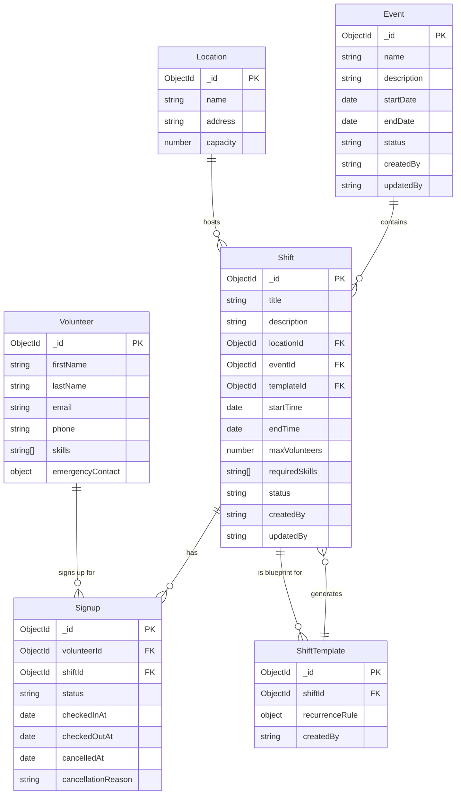

# hackillinois-systems-c
HackIllinois 2027 Systems Coding Challenge - Albert Bogdan

Using TypeScript, Express, and MongoDB, implement a volunteer backend API for creating/managing volunteer shift signups. The goal is to demonstrate your understanding of API design, database modeling, and TypeScript fundamentals. 
We recommend using Mongoose and Zod for validation, but feel free to use a different solution if you feel it better fits the problem.
We have intentionally given you few details -- we want to see that you can think about what a system needs to do and how to design it around its functionality. You do not need to handle authentication. Writing comprehensive tests is highly recommended!

## Database Schema



## Project Structure

```
src/
├── app.ts                          # Express app setup and router mounting
├── server.ts                       # Entry point — connects to MongoDB and starts server
├── common/
│   ├── db.ts                       # Mongoose connection helper
│   ├── errors.ts                   # APIError class and global error handler
│   ├── openapi.ts                  # OpenAPI/Swagger spec setup
│   ├── paginate.ts                 # Shared pagination helper for all list endpoints
│   ├── schemas.ts                  # Shared enums (SKILLS) and Zod schemas
│   ├── testSetup.ts                # Jest global setup — spins up in-memory MongoDB
│   └── testTools.ts                # Supertest request helpers (get/post/put/del)
└── services/
    ├── event/                      # Events (groups of shifts)
    │   ├── event-schemas.ts        # Mongoose model, Zod schemas, EVENT_STATUS enum
    │   ├── event-lib.ts            # Business logic (CRUD, cancel, summary, shifts list)
    │   ├── event-router.ts         # Express routes for /events
    │   └── event-router.test.ts
    ├── shift/                      # Individual volunteer shifts
    │   ├── shift-schemas.ts        # Mongoose model, Zod schemas, SHIFT_STATUS enum
    │   ├── shift-lib.ts            # Business logic (CRUD, cancel, mark-noshows, filters)
    │   ├── shift-router.ts         # Express routes for /shifts
    │   └── shift-router.test.ts
    ├── shift-template/             # Recurring shift templates
    │   ├── shift-template-schemas.ts  # Mongoose model, recurrence rule schema
    │   ├── shift-template-lib.ts      # Business logic + shift generation from recurrence rules
    │   ├── shift-template-router.ts   # Express routes for /shift-templates
    │   └── shift-template-router.test.ts
    ├── signup/                     # Volunteer-to-shift signups
    │   ├── signup-schemas.ts       # Mongoose model, Zod schemas, SIGNUP_STATUS enum, VALID_TRANSITIONS
    │   ├── signup-lib.ts           # Business logic (create, cancel, checkin/out, waitlist promotion)
    │   ├── signup-router.ts        # Express routes for /signups
    │   └── signup-router.test.ts
    ├── volunteer/                  # Volunteers
    │   ├── volunteer-schemas.ts    # Mongoose model and Zod schemas
    │   ├── volunteer-lib.ts        # Business logic (CRUD, hours tracking, leaderboard)
    │   ├── volunteer-router.ts     # Express routes for /volunteers
    │   └── volunteer-router.test.ts
    └── location/                   # Physical locations for shifts
        ├── location-schemas.ts     # Mongoose model and Zod schemas
        ├── location-lib.ts         # Business logic (CRUD, capacity validation)
        ├── location-router.ts      # Express routes for /locations
        └── location-router.test.ts
```

